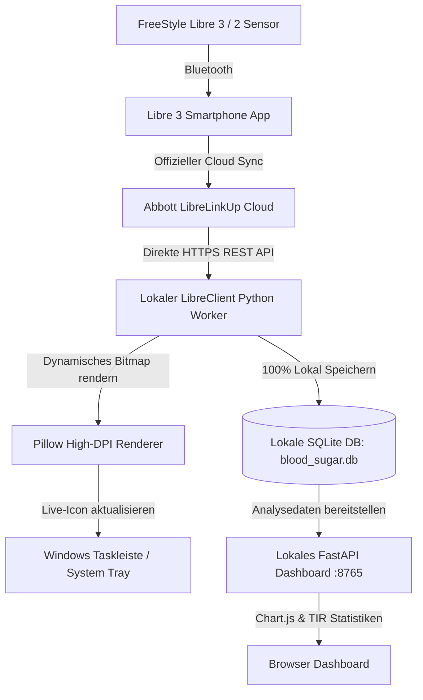

# 🩸 FreeStyle Libre Live Blood Sugar Taskbar Monitor & Local Analytics

[](https://www.python.org/)
[](https://microsoft.com/windows)
[](#-100-datenschutz--gdpr-compliance)
[](https://opensource.org/licenses/MIT)
[](https://freestylelibre.de)

> **Echtzeit-Blutzucker direkt in Ihrer Windows-Taskleiste (neben der Uhr) mit Farbcodes und Trendpfeilen — 100% lokal, datenschutzkonform und ohne externe Server.**
> 
> *Real-time continuous glucose monitor (CGM) in your Windows system tray with live trend arrows, dynamic color badges, local SQLite persistence, and an interactive analytics web dashboard.*

---

## 🌟 Hauptfunktionen / Key Features

- 🎯 **Echtzeit-Anzeige in der Taskleiste**: Zeigt Ihren aktuellen Glukosewert (in `mg/dL` oder `mmol/L`) zusammen mit dem Trendpfeil (`↑`, `↗`, `→`, `↘`, `↓`, `⇈`, `⇊`) direkt neben der Windows-Uhr.
- 🟢🟡🔴 **Farbcodierte Warnstufen**: 
  - **Grün**: Im Zielbereich (z. B. 70–180 mg/dL)
  - **Gelb/Orange**: Erhöht oder Leicht Niedrig (180–250 oder 54–70 mg/dL)
  - **Rot**: Kritischer Unter- oder Überzucker (&lt;54 oder &gt;250 mg/dL) mit optionalem Windows-Benachrichtigungston.
- 🛡️ **100% DSGVO & Privatsphäre (Zero-Server-Architektur)**: Keine Registrierung bei Drittanbietern nötig. Alle Daten und Tokens bleiben ausschließlich auf Ihrem eigenen Computer in `blood_sugar.db` und `config.json`.
- 📊 **Lokales Web-Dashboard (`http://localhost:8765`)**: 
  - Interaktive 24h / 7d / 14d Glukosekurve mit Chart.js und Zielbereich-Hinterlegung.
  - Klinische **Time in Range (TIR)** Donut-Grafik.
  - Durchschnittlicher Blutzucker (Ø), Standardabweichung (SD), Variationskoeffizient (CV%) und geschätzter HbA1c (eA1c / GMI).
  - Ein-Klick-Datenexport als CSV oder JSON für Ihren Arzt.
- ⚙️ **In-App Einrichtung**: Bequemes Verbinden mit Ihren LibreLinkUp-Zugangsdaten direkt in der Weboberfläche mit Live-Verbindungstest.
- 🪟 **Automatischer Windows-Autostart**: Ein Klick im Taskleisten-Menü genügt, um das Tool bei jeder Windows-Anmeldung im Hintergrund zu starten.

---

## 🖼️ Systemarchitektur / Architecture



---

## 🚀 Schnellstart & Installation (Deutsch)

### 1. Vorbereitung (FreeStyle LibreLinkUp Follower einrichten)
1. Öffnen Sie die **FreeStyle Libre 3 App** auf Ihrem Smartphone.
2. Gehen Sie auf **Menü ☰ ➔ Verbundene Apps ➔ LibreLinkUp**.
3. Tippen Sie auf **Verbindung hinzufügen** und laden Sie Ihre eigene (oder eine zweite) E-Mail-Adresse als Follower ein.
4. Öffnen Sie die Einladungs-E-Mail auf dem Smartphone/PC, erstellen Sie das kostenlose LibreLinkUp-Konto und akzeptieren Sie die Nutzungsbedingungen.

### 2. Connector starten
```bash
# 1. Repository klonen
git clone https://github.com/konradschrein-star/freestyle-libre-live-bloodshugar-connector.git
cd freestyle-libre-live-bloodshugar-connector

# 2. Abhängigkeiten installieren
pip install -r requirements.txt

# 3. Starten (oder doppelt auf start.bat klicken)
python main.py
```

*Tipp für lautlosen Hintergrundbetrieb ohne Konsolenfenster*: Doppelklick auf `run_silently.vbs`.

### 3. Konto verbinden
- Beim ersten Start öffnet sich automatisch das lokale Dashboard unter `http://127.0.0.1:8765`.
- Tragen Sie Ihre LibreLinkUp E-Mail und Ihr Passwort ein.
- Klicken Sie auf **"Verbindung jetzt live testen"** ➔ Ihr Sensor und aktueller Blutzucker werden sofort erkannt!
- Klicken Sie auf **"Einstellungen speichern"** ➔ Das Taskleisten-Icon zeigt ab sofort Ihren Live-Wert an!

---

## 🇬🇧 Quickstart Guide (English)

### 1. Setup LibreLinkUp Follower
1. Open the **FreeStyle Libre 3 App** on your phone.
2. Tap **Menu ☰ ➔ Connected Apps ➔ LibreLinkUp**.
3. Tap **Add Connection** and invite your email as a follower.
4. Accept the invitation email and complete the free LibreLinkUp account setup.

### 2. Launch the Application
```bash
git clone https://github.com/konradschrein-star/freestyle-libre-live-bloodshugar-connector.git
cd freestyle-libre-live-bloodshugar-connector
pip install -r requirements.txt
python main.py
```

### 3. Connect & Enjoy
- The local browser dashboard opens at `http://127.0.0.1:8765`.
- Enter your LibreLinkUp credentials and click **Test Connection Live**.
- Hit **Save Settings** — your real-time blood sugar is now live next to your Windows clock!

---

## 📊 Taskleisten-Menü / Tray Context Menu

Ein Rechtsklick auf das Taskleisten-Symbol öffnet das Schnellmenü:

```text
🟢 118 mg/dL ↗ (Normal, vor 1 Min)
📊 Ø 24h: 122 mg/dL | TIR: 92%
─────────────────────────────────
🔄 Jetzt aktualisieren
📊 Dashboard & Diagramm öffnen
⚙️ Konto & Einstellungen
🪟 Mit Windows automatisch starten [✓]
─────────────────────────────────
🚪 Beenden
```

---

## 🔒 100% Datenschutz & GDPR / DSGVO Compliance

- **Keine Telemetrie**: Es werden keinerlei Nutzungsdaten, IP-Adressen oder Messwerte an uns oder Dritte übertragen.
- **Lokale Datenbank**: Sämtliche Glukosedaten werden in einer standardisierten lokalen SQLite-Datei (`blood_sugar.db`) auf Ihrer Festplatte gespeichert.
- **Direkte Kommunikation**: Die App kommuniziert verschlüsselt (TLS/HTTPS) ausschließlich und direkt zwischen Ihrem Rechner und den offiziellen Abbott-Servern (`api-eu.libreview.io`).

---

## 📦 Standalone EXE erstellen (Ohne Python-Installation)

Möchten Sie eine eigenständige `.exe`-Datei für Windows erstellen?
Führen Sie einfach das mitgelieferte Build-Skript aus:

```cmd
build_exe.bat
```
Die fertige `FreeStyleLibreTaskbar.exe` befindet sich anschließend im Ordner `dist/FreeStyleLibreTaskbar/`.

---

## 🛠️ Technologien / Stack

- **Python 3.10+** (Asynchron, typisiert)
- **pystray & Pillow (PIL)**: High-DPI Windows Taskbar Icon Generator
- **FastAPI & Uvicorn**: Lokaler Hochleistungs-Webserver & REST API
- **SQLite3**: Lokale Langzeitspeicherung & klinische Metriken
- **Chart.js & Tailwind CSS**: Modernes Web-Dashboard im Dark Mode

---

## ⚠️ Medizinischer Hinweis / Medical Disclaimer

*Dieses Projekt ist ein inoffizielles Open-Source-Tool für den persönlichen Gebrauch und steht in keiner Verbindung zu Abbott Laboratories. Es dient ausschließlich Informationszwecken und ersetzt keine professionelle medizinische Beratung, Diagnose oder Behandlung.*

---

## 📄 Lizenz / License

MIT License — Frei verwendbar für persönliche und Open-Source-Projekte. Siehe [LICENSE](LICENSE) für Details.
